# Приложение для организации мероприятия и голосований по вопросам 
---

### Стек: Django + DRF, Flutter (Chrome Web)

#### Скриншоты Административной части:

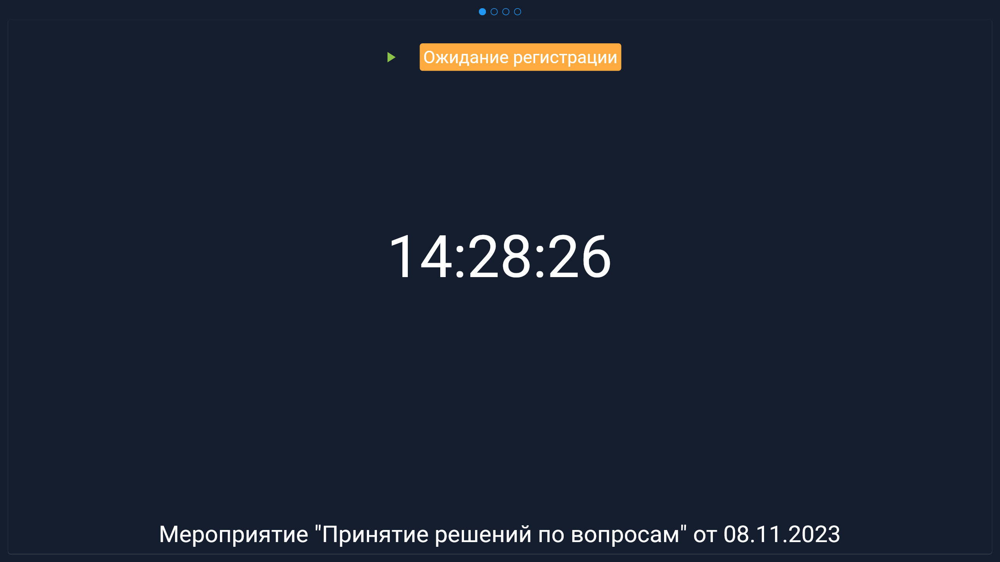

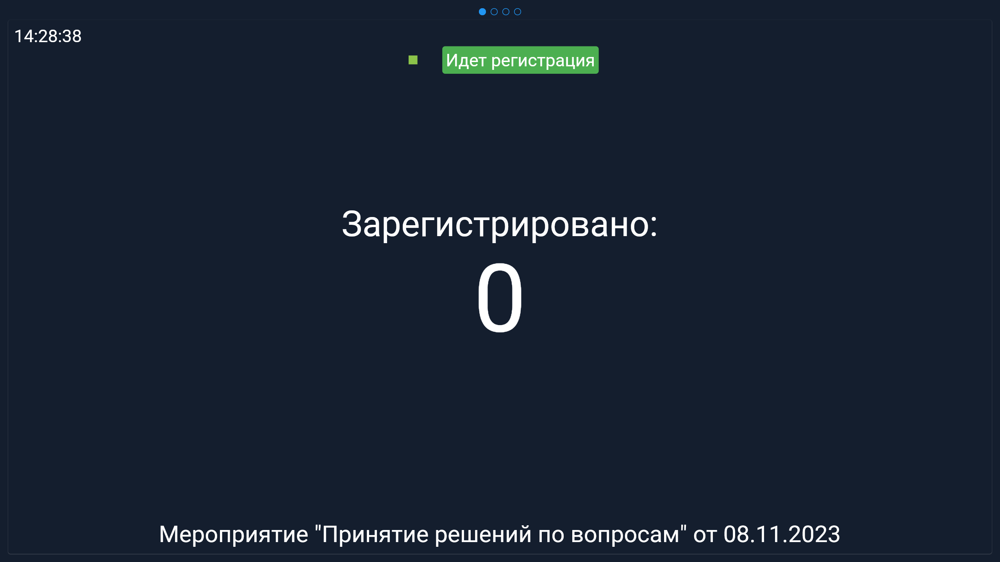

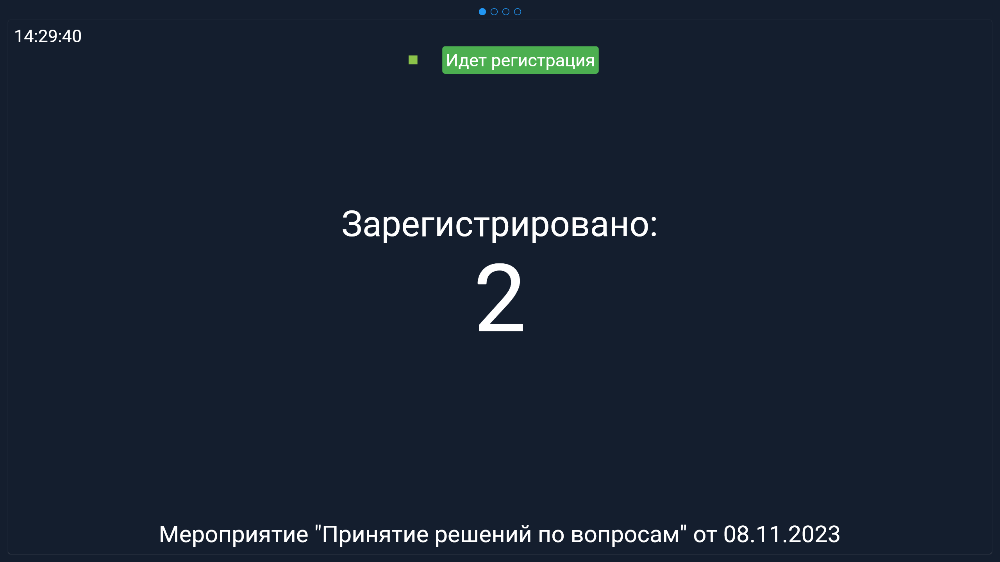

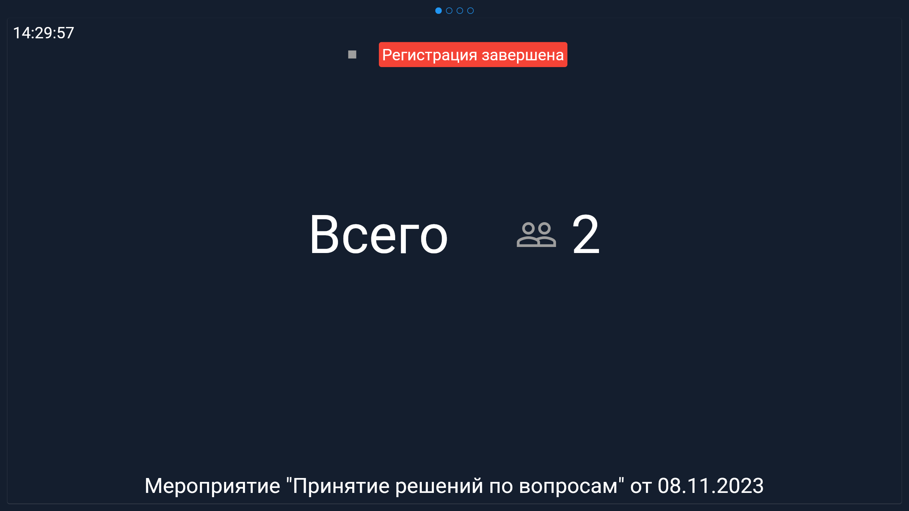

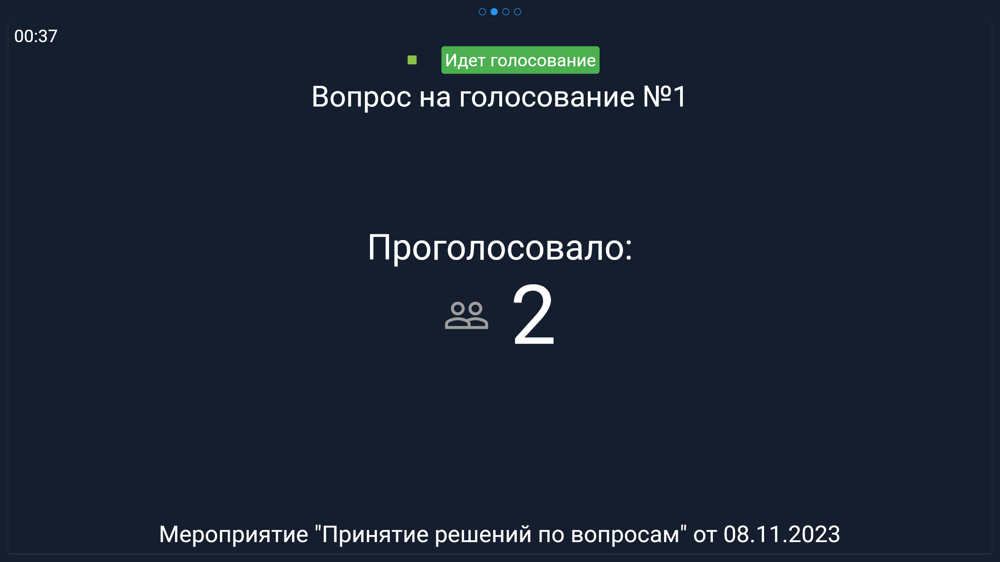

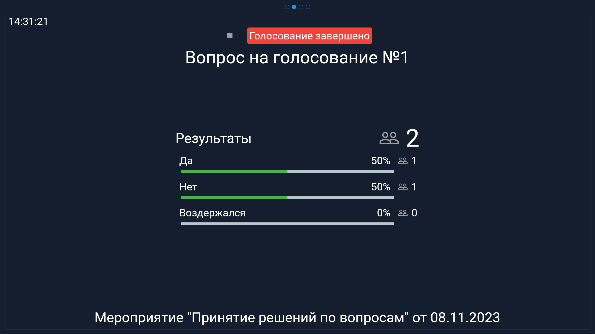

#### Скриншоты клиентской части:

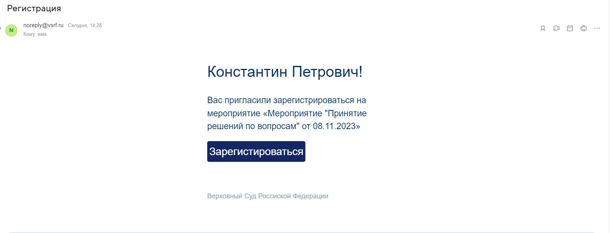

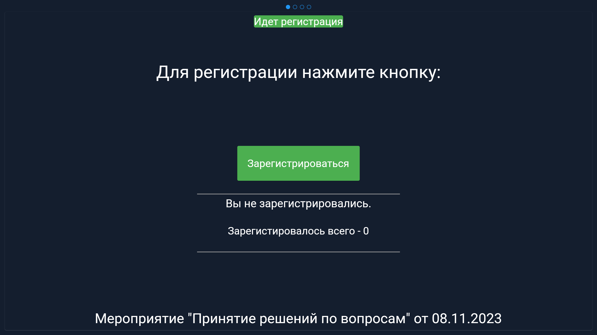

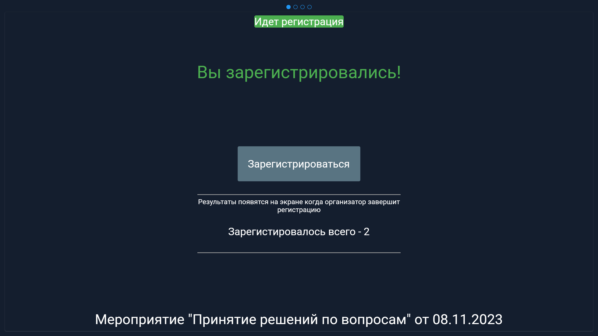

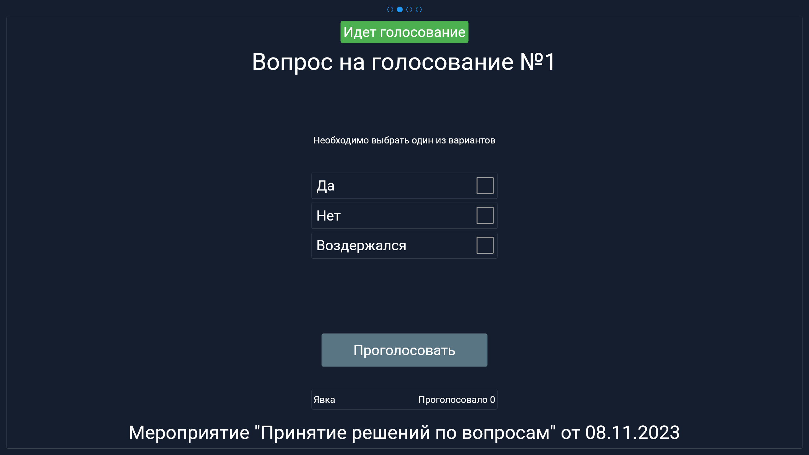

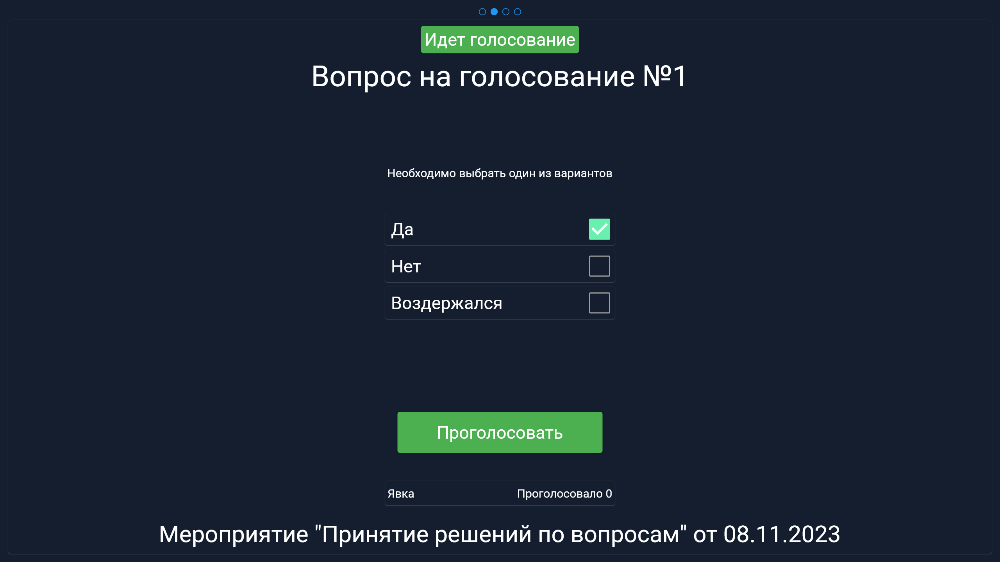

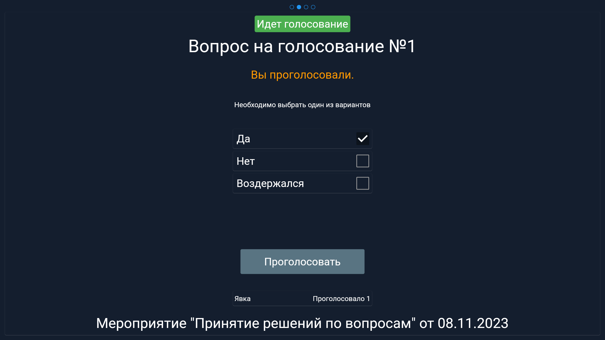

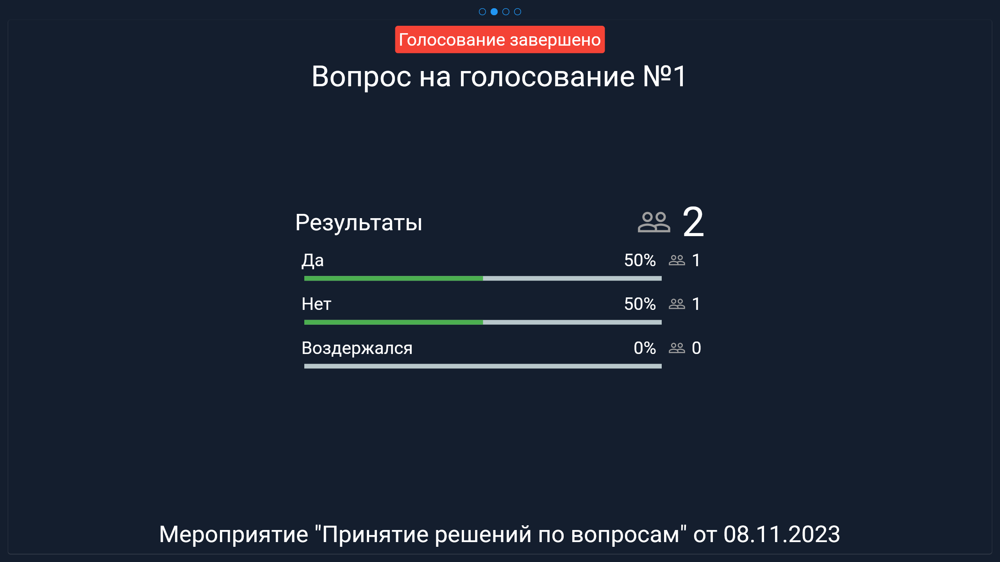

